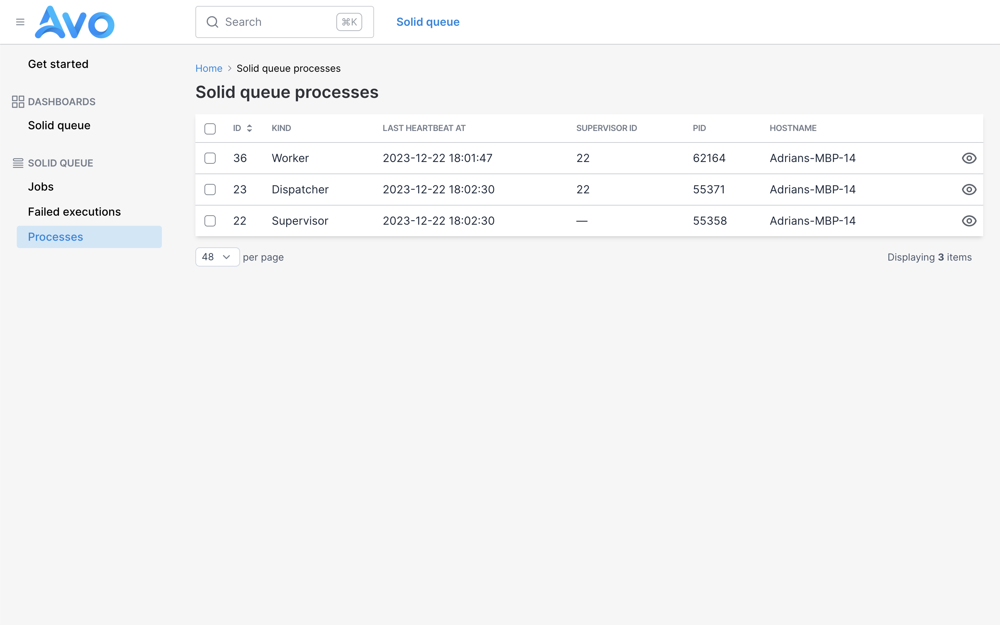

# Avo 3 Solid Queue template

## How to

1. Add Avo to your app.
2. Apply this template
3. Manually add the `main_menu` items in the `avo.rb` initializer

### Add this to your `avo.rb` initializer

```ruby
  config.main_menu = -> {
    section "Dashboards", icon: "dashboards" do
      all_dashboards
    end

    section "Solid Queue", icon: "queue-list" do
      resource :solid_queue_jobs, label: "Jobs"
      resource :solid_queue_failed_execution, label: "Failed executions"
      resource :solid_queue_processes, label: "Processes"
    end
  }
```

## Screenshots



